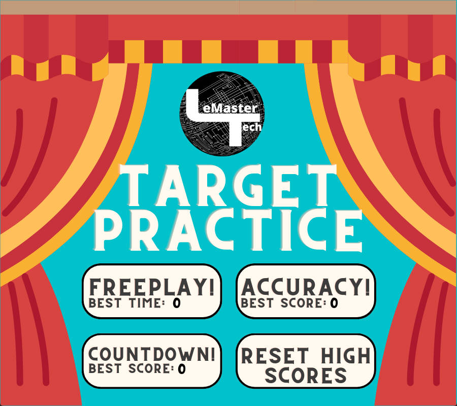

# Pygame Shooting Game

Welcome to the Pygame Shooting Game! This is a simple shooting game where you can shoot targets to earn points. The game has different levels, modes, and scoring mechanisms. Enjoy playing and try to beat your high scores!

## Requirements

- Python 3.7
- Pygame library

## Installation

1. Clone the repository:

   ```bash
   git clone https://github.com/kkjustadream/ShootingGame.git
    ```
   
2. Install the Pygame library:

   ```bash
   pip install pygame
   ```
   
3. Run the game:

   ```bash
   python main.py
    ```
## How to Play


- Launch the game.

- Choose a game mode from the main menu: Freeplay, Ammo, or Time.

- Aim and shoot targets to earn points.

- Complete each level by eliminating all targets.

- Try to achieve the highest score and beat your personal best.


## Controls


- **Mouse:** Aim and shoot

- **Pause Button (in-game):** Click to pause the game and access the menu.


## Scoring


- Earn points by shooting targets.

- Points are awarded based on the size and difficulty of the targets.


## Game Modes


1. **Freeplay:**

  - Play for an unlimited time.

  - Aim for the highest score.


2. **Ammo:**

  - Limited ammo (81 shots).

  - Score as many points as possible with limited ammo.


3. **Time:**

  - Limited time (40 seconds).

  - Score as many points as possible within the time limit.


## High Scores


- The game keeps track of high scores for each game mode.

- Try to beat your high scores and set new records!


## Screenshots


*Main Menu*


*Gameplay*

*Gameplay*

*Gameplay*

## Credits
- Reference: plemaster01

